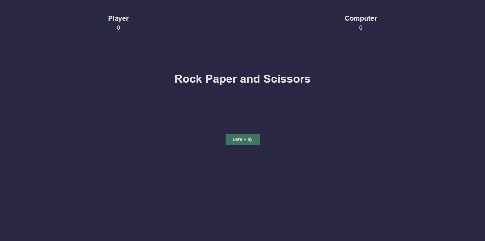
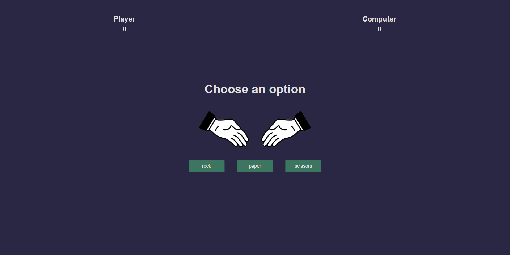
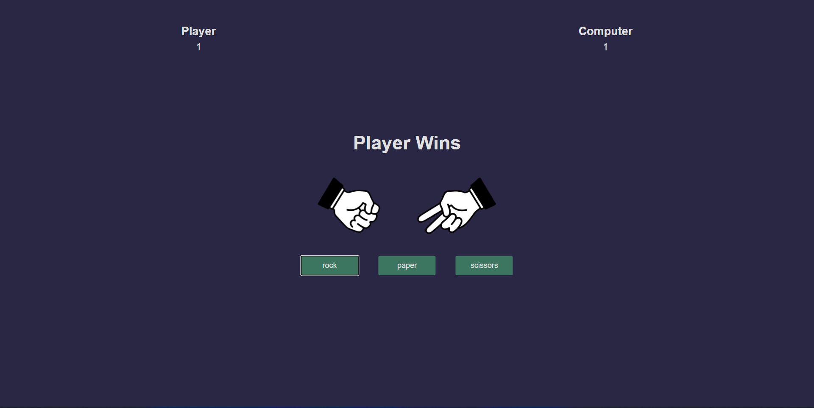
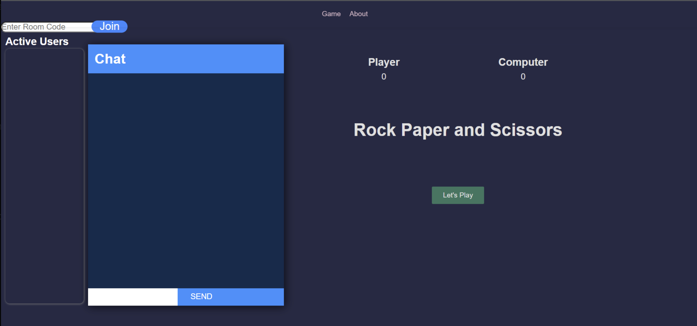
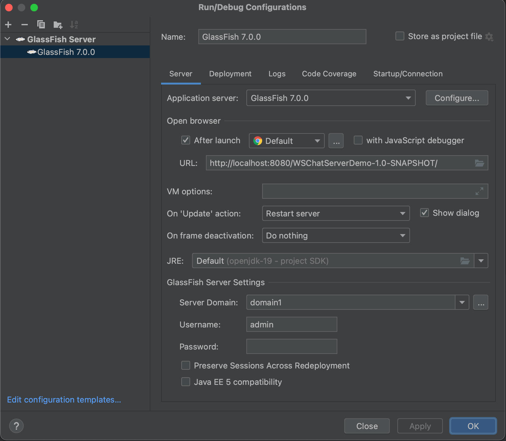

# w23-csci2020u-project-team47-1

# INTERACTIVE CLIENT ROOM
> Course: CSCI 2020U: Software Systems Development and Integration

The following application is a interactive chatroom where clients can chat to each other alongside playing games such as Rock Paper Scissors and having a fun time.
## Scope
* Our goal was to code a Java web application that uses websockets and HTML/javascript/CSS that allows multiple clients to chat and play games at the same time.
* We want to have the screen show the live chat server on the left side while having the rock paper scissors game on the right side.

## Overview
* We coded our own application using Java web application.
* The chat room that we created uses websockets and HTML/Javascript/CSS.
* Our application allows multiple clients to chat in a room and play games at the same time.
* Lastly the user needs to be in a room for them to be able to send messages.

## HOW TO USE APPLICATION
**Connect to the websocket**
* 1st. git clone the repository
* 2nd. once you have configured and let the IDE install maven and all the necessary requirements
* 3rd. create a new local configuration of glassfish with the following configuration shown in

## Chat interaction and functionalities

The user must either establish or join an existing room in order to use the online application. The user can type in the code of a certain room they would like to join.
The user will be prompted to enter a username when entering a new room. The new user will be welcomed by the room. The server will also let individuals who were already in the room know that a new user has joined.
You will print the timestamp next to each chat message.When the user presses the enter key, the messages are sent. A "send" button is an optional addition.

**CREATE a new (unique) room code**
* Upon opening the application, enter a code, you will then either join a room that already exists in that name or create a new one.

**START a new game**
* Users will have the option to start a new game of rock paper scissors with the clients in the room, keep in mind there must be 2-3 clients in order to play.

## Functionality
We ran into some problems with our chatserver portion of the project. Our goal was to have both the Rock Paper Scissors game
running at the same time, with clients being able to chat and play the game. Unfortunately,
the live chat server was having issues, we could not fix the send button and textbox. The textbox would not return the messages from the backend side,
the send button would not function properly as it would refresh the page. Another issue was that the active users list would not register the username, and the room code would not auto generate.
Overall, the issues we had were not with the rock paper scissors game, but with the live chat server.

**CREATE a new (unique) room code**

## Video Link
https://youtu.be/FWtn0TvYP-M

## Happy Chatting!
- Roman Ahmad Zeia, Kevin Waran, Ryan Liu, Jathushan Vishsnukaran

